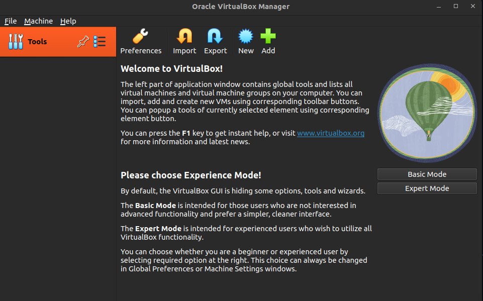
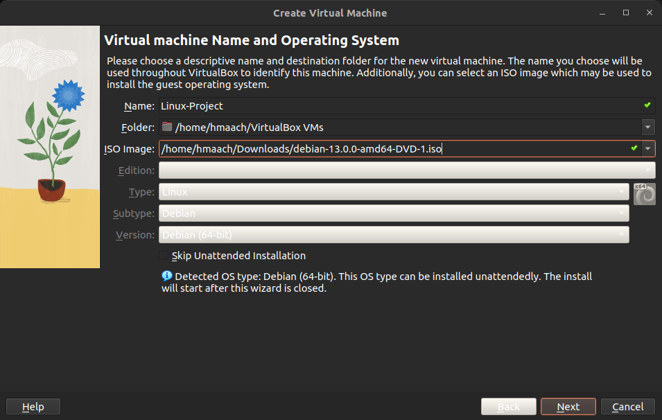
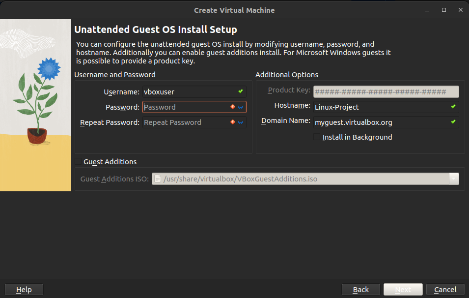
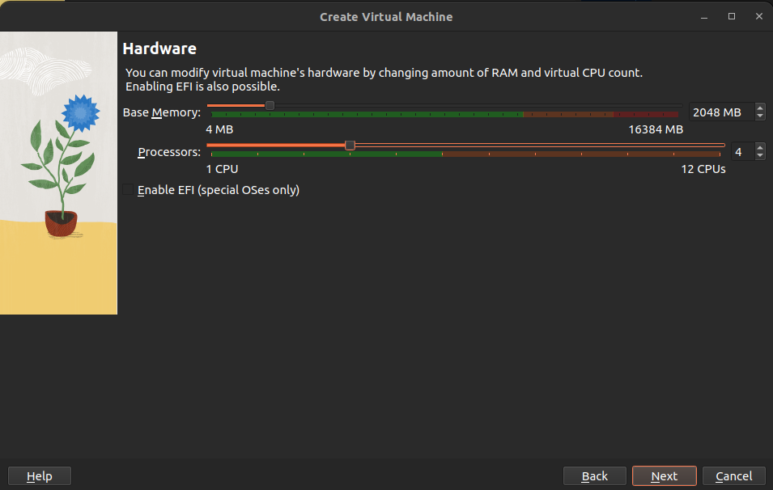
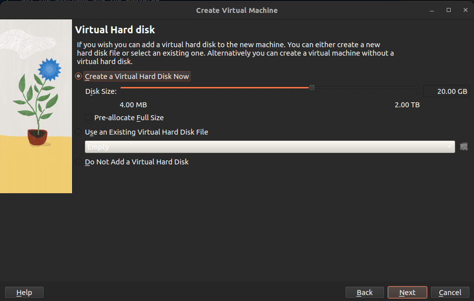
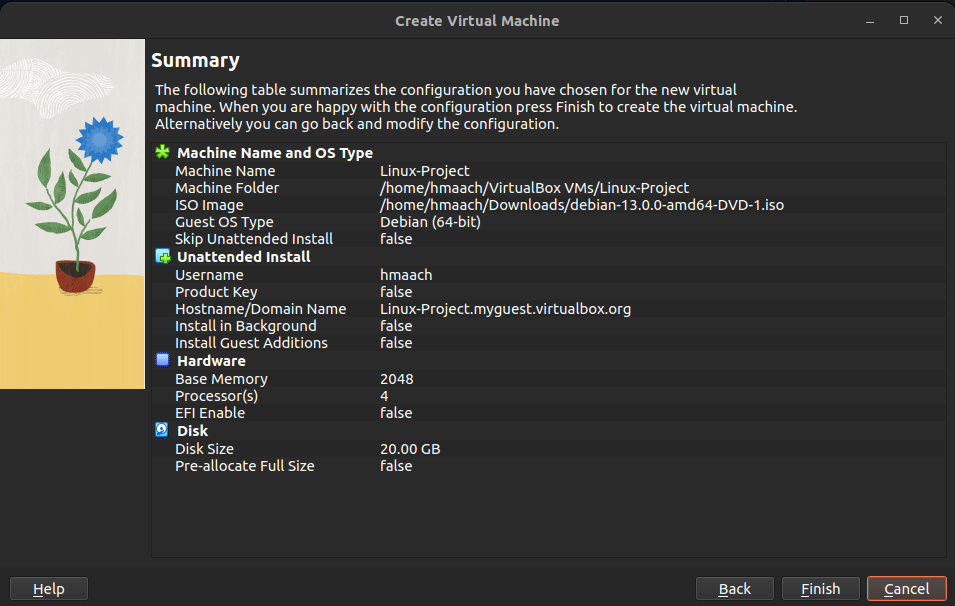
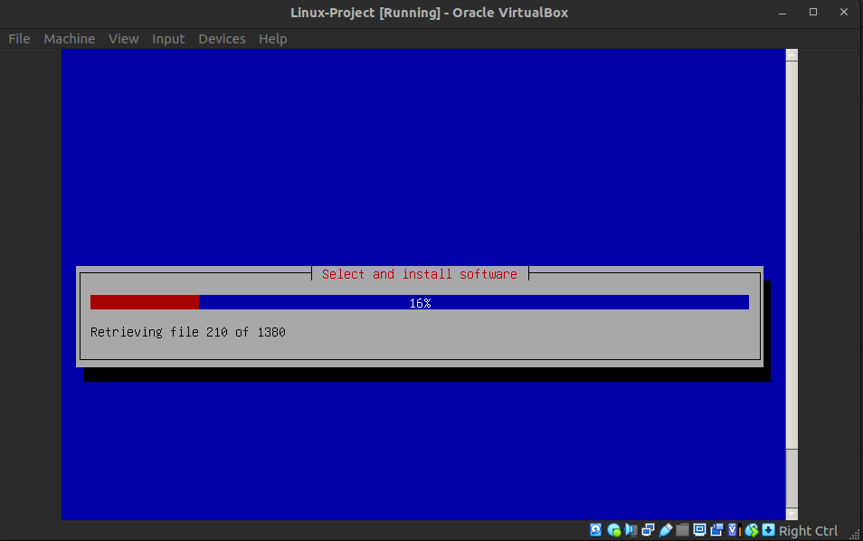
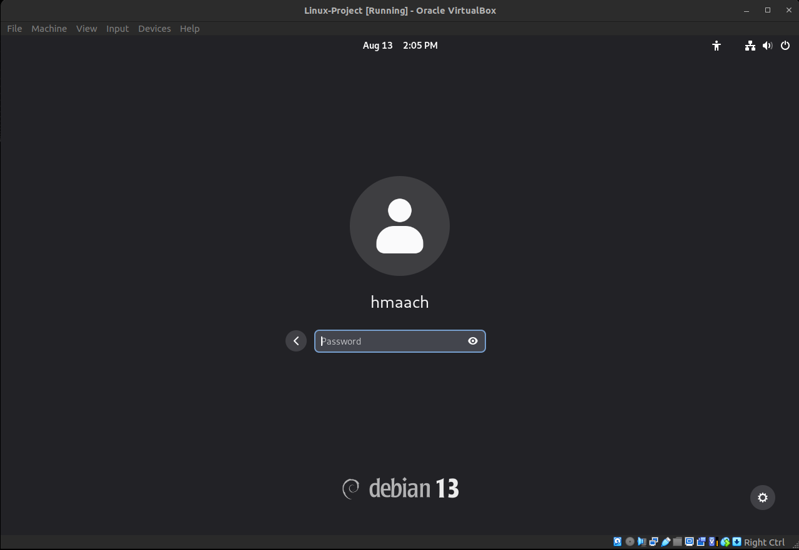

# Linux

## 1 - Install ISO Image for Debian

Use the following command to download the official Debian ISO image:

```bash
wget -P ~/Downloads/ https://cdimage.debian.org/debian-cd/current/amd64/iso-dvd/debian-13.0.0-amd64-DVD-1.iso 
````

✅ This will save the ISO file in your `~/Downloads/` directory.

---

## 2 - Open Oracle VirtualBox

Launch **Oracle VirtualBox** on your system:



---

## 3 - Create a New Virtual Machine

1. Click **"New"**.
2. Enter a name (e.g., `Linux-Project`).
3. Select the ISO image from `~/Downloads/`.
4. Choose **Type**: `Linux`.
5. Choose **Version**: `Debian (64-bit)`.
6. Then press **Next**.



---

## 4 - Set the Username and Password

During the setup, you will be prompted to create a user.



---

## 5 - Configure the VM

* **Memory**: Allocate at least **2048 MB (2 GB)** of RAM.
* **Processors**: Allocate at least **4 CPU cores**.



---

## 6 - Configure the Storage

* **Hard Disk**: Create a virtual hard disk (e.g., **20 GB** or more).



---

## 7 - Finish

Click **Finish** to complete the VM setup.



---

## 8 - Wait for Mounting and Installation

Once the VM starts, Debian will begin installation from the ISO.



---

## 9 - Log Into Debian

After the installation is complete, log in with the username and password you set earlier.



✅ You now have a fully functional Debian 13 system running in VirtualBox!

---

## 10 - Gracefully Shutdown the VM

Once you are done using the VM, shut it down properly:

1. Open **Terminal** inside the VM.
2. Run the following command:

```bash
sudo shutdown -h now
```
or by runing this command from the host OS terminal

```bash
VBoxManage controlvm "VM" acpipowerbutton
```
---

You're now ready to explore Linux and begin working on your project!
