# Login

## Installing a Virtual Machine (VM)

If you need help installing Debian on VirtualBox, follow this guide:
👉 👉 **[https://github.com/hmaach/blogs/linux/debian-vm-setup](https://github.com/hmaach/blogs/blob/main/linux/debian-vm-setup/README.md)**

---

# Summary of Concepts

- Logging into a Linux console
- Using basic keyboard shortcuts
- Changing passwords (`passwd`)
- Checking history (`history`)
- Connectivity basics
- Essential Linux commands:

  - `ls -i` → show file inodes
  - `id -u` → show user ID
  - `pidof`, `pgrep` → find process IDs
  - `ip a` → get IP address

---

# Diagrams With Descriptions

---

## Users Diagram

This diagram shows the system users and their corresponding **UIDs (User IDs)**.
UID `0` is always **root**, and normal users typically start from `1000`.

```mermaid
flowchart TD
subgraph Users
    U1["root → 0"]
    U2["student → 1000"]
end
```



**Useful commands:**

- Show current user UID:

  ```bash
  id -u
  ```

---

## Network Resolution Diagram

This diagram represents how domain names resolve to IP addresses and then to their **32-bit integer representation** (the numeric form of IPs).

```mermaid
flowchart TD
subgraph Network
    N1["google.com → 216.58.214.14 → 3627734542"]
    N2["tencent.com → 117.169.101.44 → 1974035756"]
end
```



**Useful commands to get your IP:**

- Show all network interfaces:

  ```bash
  ip a
  ```

- Show only the main IP:

  ```bash
  hostname -I
  ```

- Resolve an IP from a domain name:

  ```bash
  ping -c1 google.com
  ```

---

## Files & Inodes Diagram

This diagram shows files mapped to their **inode numbers**, which uniquely identify them on the filesystem.

```mermaid
flowchart TD
subgraph Files
    F1["/etc/fstab → 44696029"]
    F2[".profile → 59639363"]
end
```




The next diagram illustrates how symlinks, filenames, hard links, inodes, and data blocks are connected internally.


**Useful command:**

- Show inode of a file:

  ```bash
  ls -i filename
  ```

---

## Ports Diagram

This diagram shows common service ports:
HTTP = **80**, HTTPS = **443**.

```mermaid
flowchart TD
subgraph Ports
    P1["HTTP → 80"]
    P2["HTTPS → 443"]
end
```



**Useful command to see listening ports:**

```bash
ss -tulnp
```

---

## Processes Diagram

This shows running processes and their **PIDs (Process IDs)**.
Example: `cron` running with PID `254`.

```mermaid
flowchart TD
subgraph Processes
    PR1["cron → 254"]
end
```



**Commands to find a process ID:**

- Using `pidof` (simple):

  ```bash
  pidof cron
  ```

- Using `pgrep` (more advanced):

  ```bash
  pgrep cron
  ```

- Show your current shell's PID:

  ```bash
  echo $$
  ```
